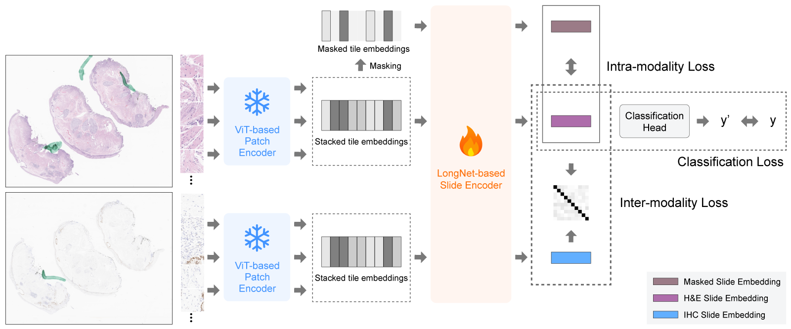

# HistoStainAlign

This repository contains the code for the paper, [Cross-Modality Learning for Predicting IHC Biomarkers from H&E-Stained Whole-Slide Images](https://www.arxiv.org/abs/2506.15853). HistoStainAlign is a novel deep learning framework that predicts IHC staining patterns directly from H&E whole-slide images (WSIs). The framework integrates paired H&E and IHC embeddings through a contrastive training strategy, capturing complementary features across staining modalities without patch-level annotations or tissue registration. The model was evaluated on gastrointestinal and lung tissue WSIs with three commonly used IHC stains: P53, PD-L1, and Ki-67.

# Dependencies

See `requirements.txt`. Please also install [Gigapath](https://github.com/prov-gigapath/prov-gigapath) and its dependencies.

# Usage

## 1. `00_extract_tile_embeds.py`
Extract tile embeddings using the Gigapath tile encoder.

## 2. `01_train_model_with_classification_head.py`
Train a model using the HistoStainAlign framework.

## 3. `02_generate_slide_embeddings.py`
Generate slide-level embeddings for H&E WSIs from the trained model.

## 4. `03_run_linear_probe.py`
Evaluate the slide embeddings against the baseline using linear probing.
